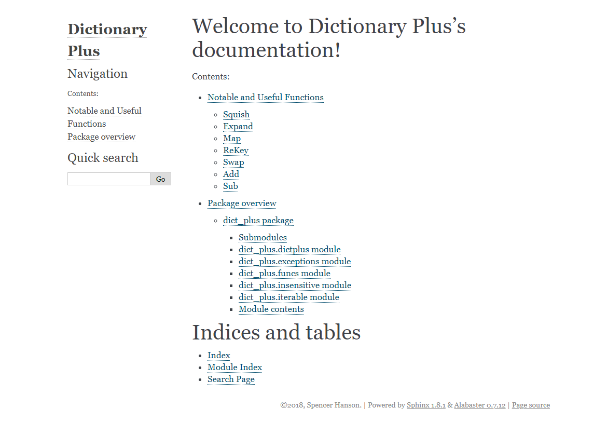
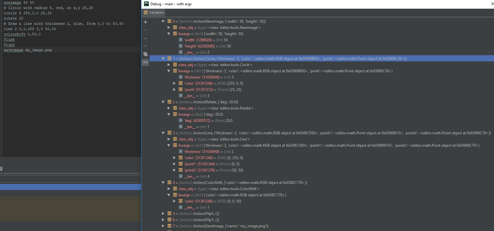
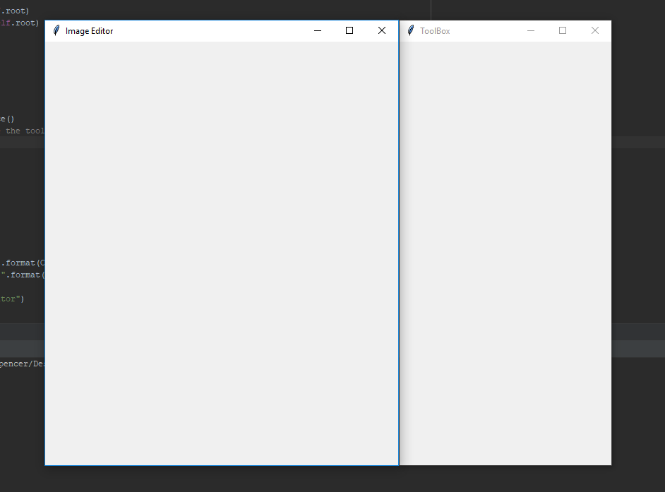
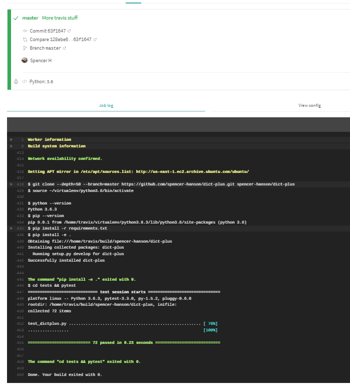

# Homework 3 

## Planned features to implement
- Convert dict-plus tests to test-suite formatting
- Basic image creation syntax parser
    - able to break down the command and then parse out the arguments
- Basic GUI
    - Main window with blank space for drawing
    - Blank sub window on the side with space for buttons
- Basic Library Documentation		
- Auto-generated sphinx documentation for base classes, with written explanations (docstrings) and placeholders for images 
- Implementation of the following subclasses in dict-plus (with examples)
    - CaseInsensitiveDict
    - PrefixInsensitiveDict
    - SuffixInsensitiveDict
    - FunctionalInsensitiveDict

- Example function documentation for
    - squish
    - expand
    - map
    - remap
    - swap
    - add
    - sub

##  What was actually accomplished
Everything!

This was because
## What is planned for the next deadline
- Following editing features, along with ICS (Image Creation Syntax) equivalents 
    - Circle
    - Line
    - Save Image
    - Load Image
    - Drawing functionality with Brush class
- Implementation of the following subclasses (with examples)
    - FunctionDictPlus
    - FunctionallyOrderedDictPlus
    - TwoWayDictPlus
- Example function documentation for 
    - split
    - multiply
    - divide
    - add
    - sub
    - chop

## Screenshots
### Documentation working

### Image Command Syntax Parsing

### Basic Gui Working

### Travis CI test suite integration
