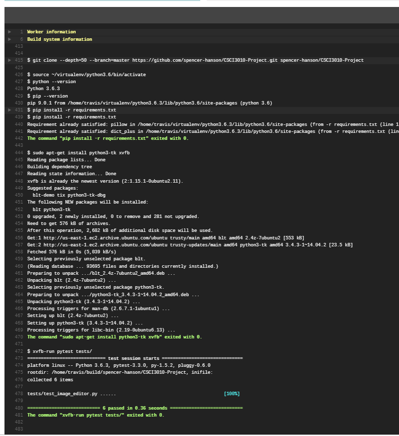

# Homework 5 (Final Checkpoint 1)

## Planned features to implement
All **planned** features added, **bonus** features:
- Pick brush color with color wheel
- Make Colorize color and saturation pickable
- Make Rotation pickable
- Fix Travis with xvfb (screen virtualization library)
- Brush size easier to changee
- Fix 'new image' bug (wouldn't clear last buffer)
- Reorganize UI
- Optimized brushes and brush selection system
- Expanded test suite

##  What was actually accomplished
Everything!

## What is planned for the next deadline
Nothing, final deadline!

## Screenshots
### Travis Fixed!
