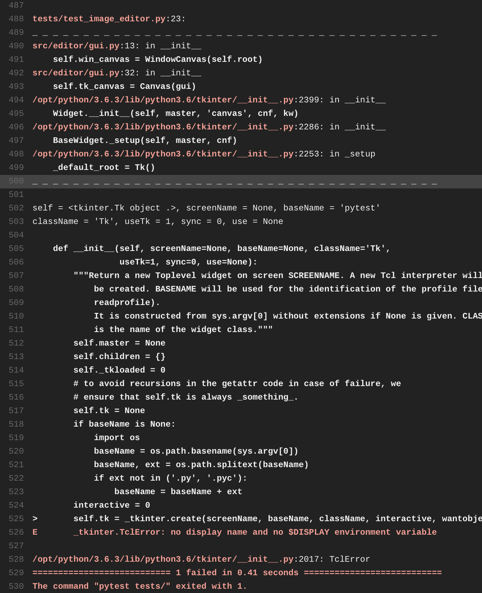

# Homework 5 (Final Checkpoint 1)

## Planned features to implement
- Function documentation for
    - funcmap
    - fold_left
    - fold_right
    - compare
    - lt, gt, gte, lte, eq, neq
- Test suite integration using ICS, all currently implemented features
- Test suite integration with GitHub (travis-ci)
- Following editing features, along with ICS (Image Creation Script) equivalents 
    - FlipX
    - FlipY
    - Rotate
    - ColorShift

***Note: The following are included for the next checkpoint as well***
    
- Will need to write scripts for each function
    - squish
    - expand
    - map
    - remap
    - swap
    - merge
    - drop
    - split
    - multiply
    - divide
    - add
    - sub
    - update, unupdate
    - chop
    - funcmap
    - fold_left
    - fold_right
    - compare
    - lt, gt, gte, lte, eq, neq

##  What was actually accomplished
Everything, but the tasks for the subclasses was changed to optimize the program with PIL loading,
automated travis can't import TkInter since it's headless

## What is planned for the next deadline
Nothing! Finished all requirements in preparation for finals.

## Screenshots
### Testing Succeeds on localhost, fails on travis (see above)

### Transforms in the GUI

### New Documentation Functions

### Code Examples added

### Documentation uploaded to readthedocs
https://dict-plus.readthedocs.io/en/latest/
